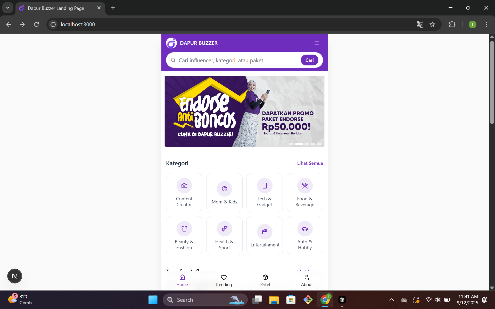
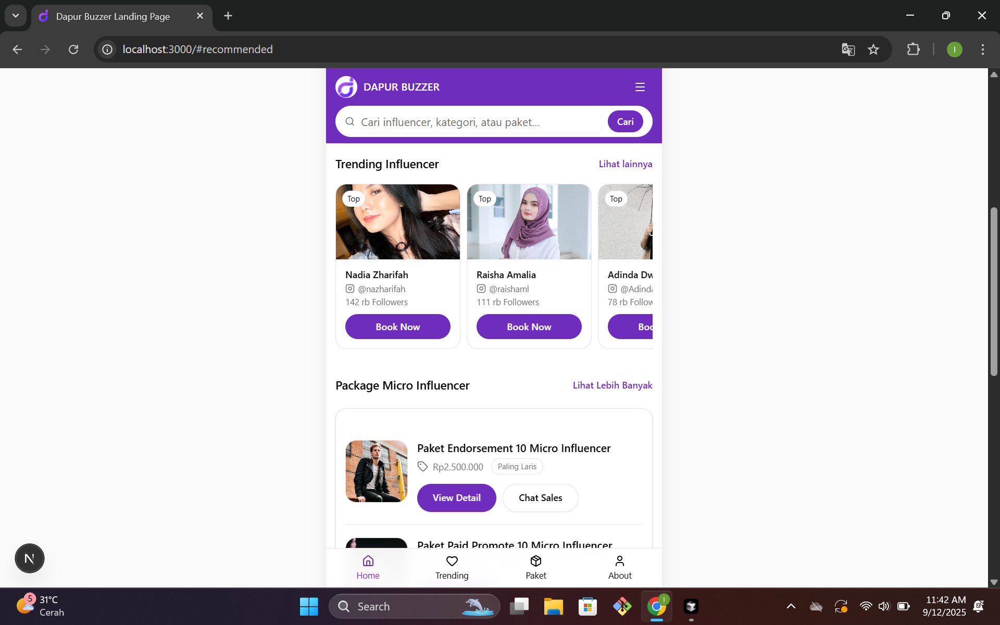
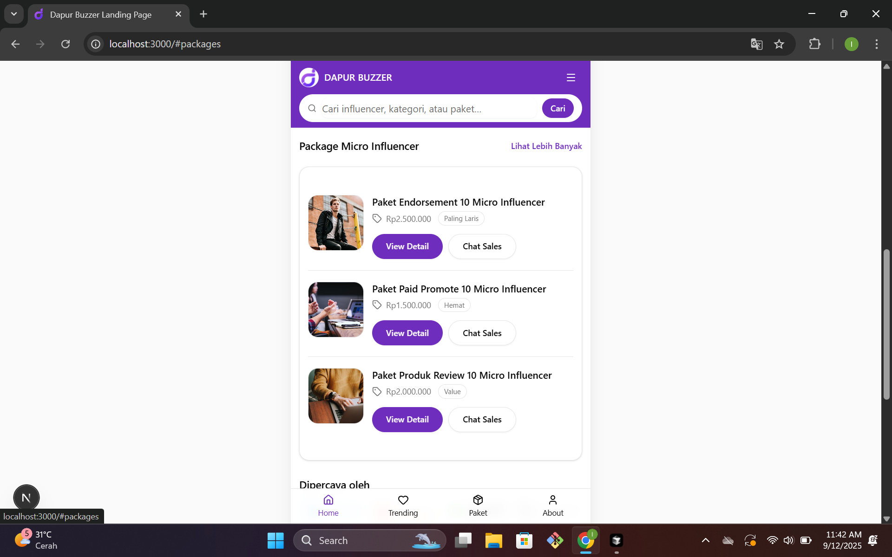
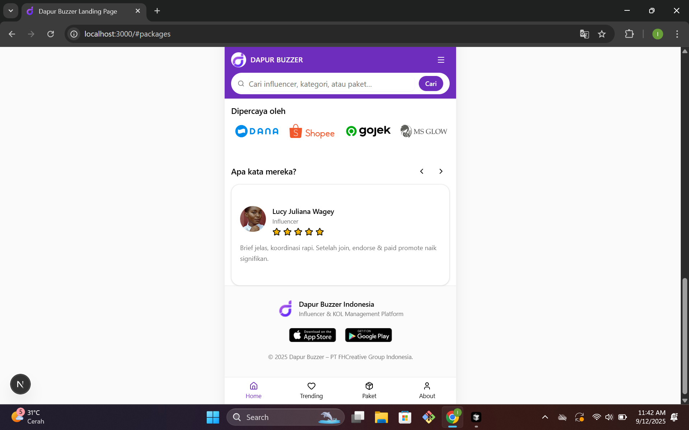
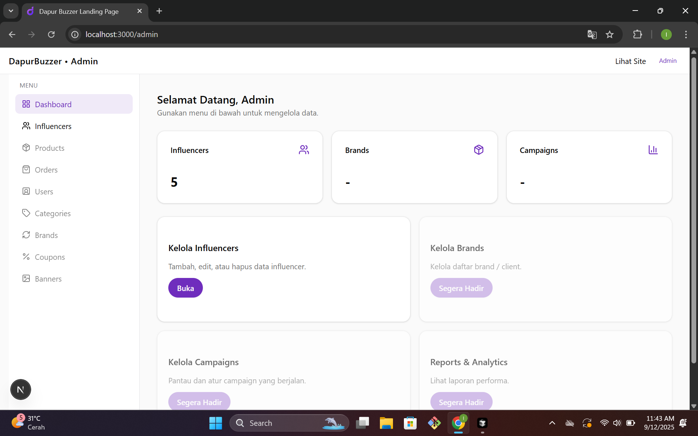
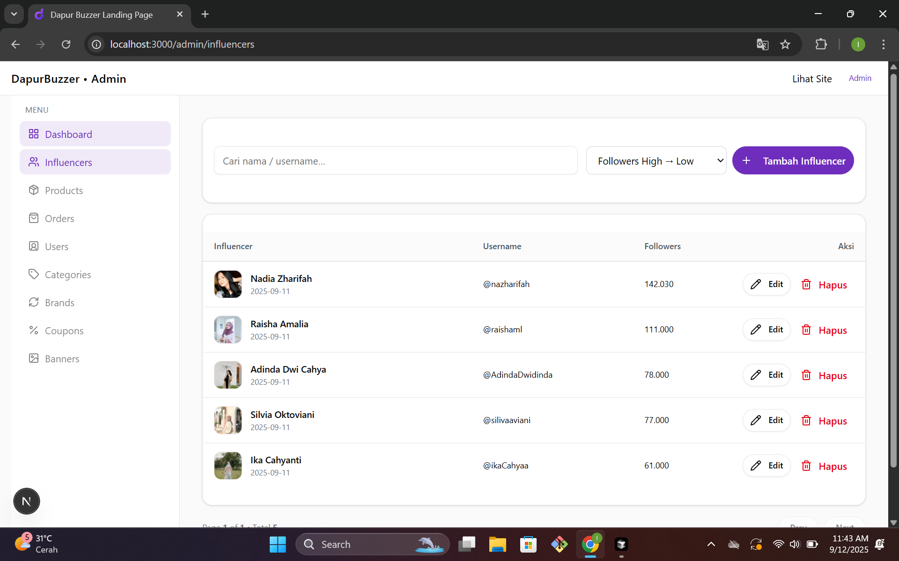
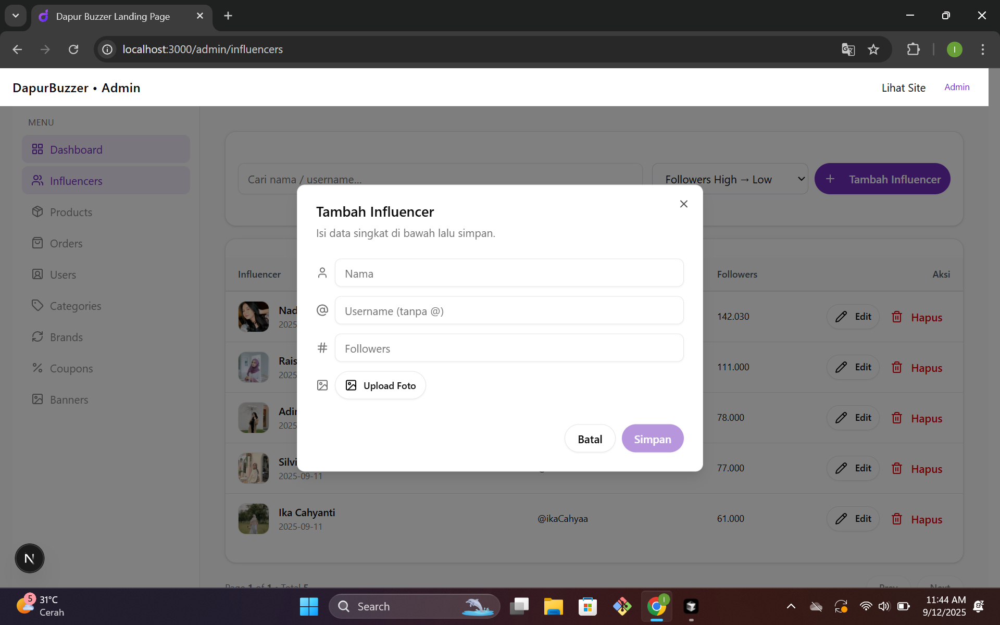
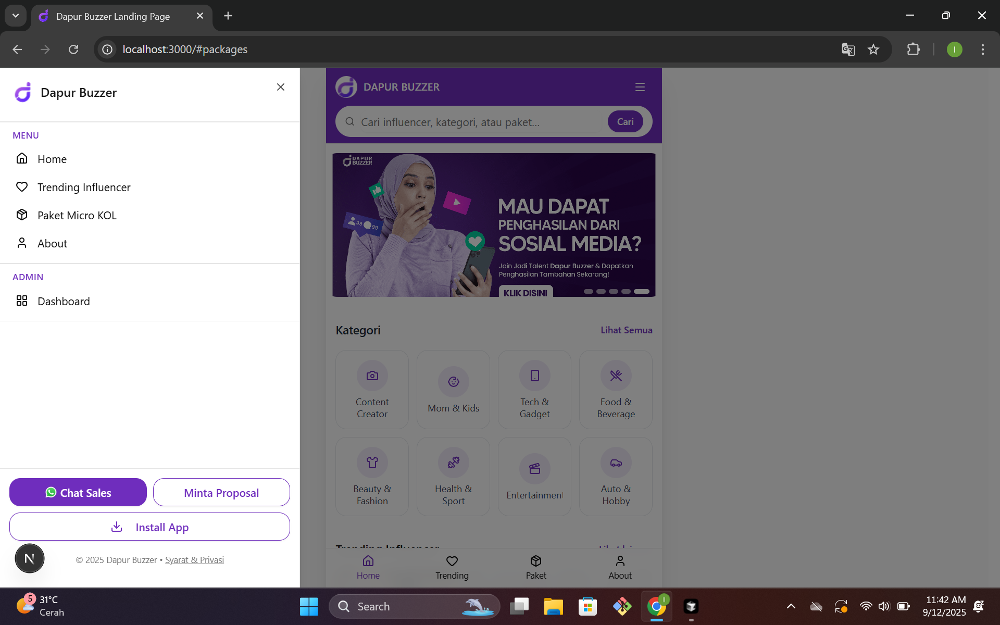
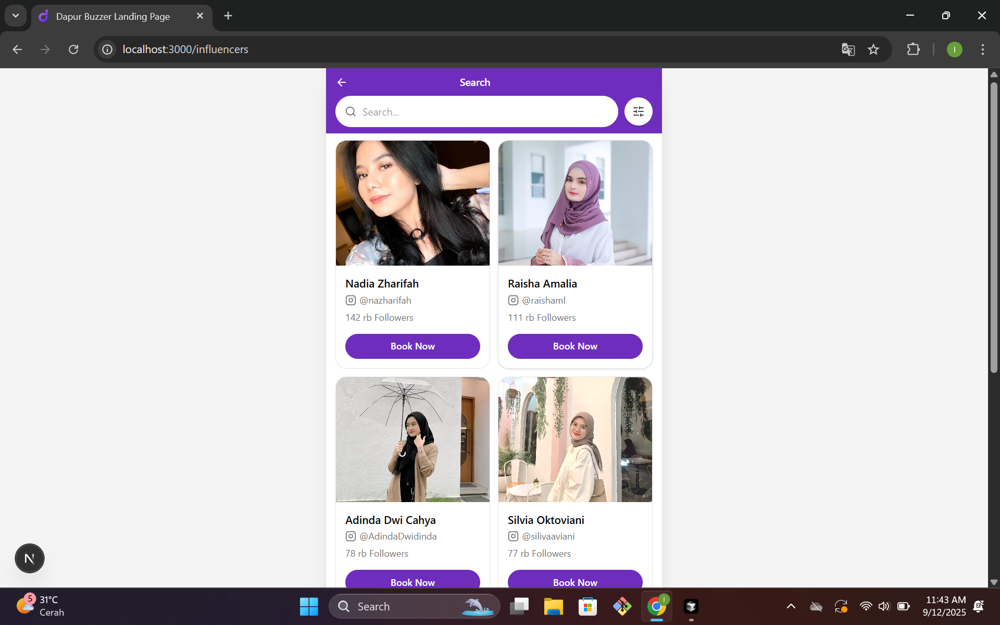
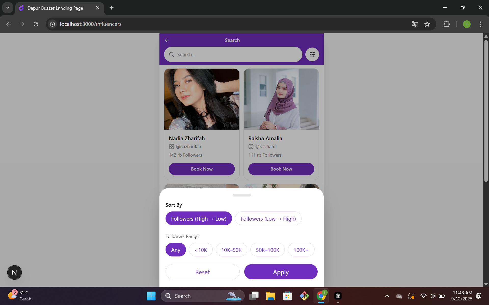

# Landing Page Dapurbuzzer (Case Study)

## Screenshots

### Homepage





### Dashboard




### Sidebar


### Search



---

## Installation & Development

Clone repository:

```bash
git clone https://github.com/alwi2022/landingpage-dapurbuzzer-pwa-.git
cd landingpage-dapurbuzzer-pwa-

Install dependencies:
npm install

Run development server:
npm run dev
Open http://localhost:3000 in your browser.